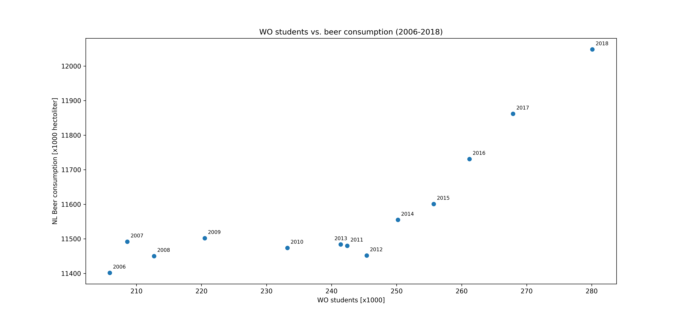

Student number: 16854098
---------------------------------------------------------

Papers:
- The Rise of Coccidioides: Forces Against the Dust Devil Unleashed
- An analysis of the forces required to drag sheep over various surfaces
- The neurocognitive effects of alcohol on adolescents and college students
---------------------------------------------------------

### Correlation plot for the task:

### Interpretation of the plot:
Our plot represents the relationship between the number of WO students and total beer consumption in the Netherlands across years 2006-2018. Every data point indicates one year. The plot indicates a positive correlation (r = 0.82) between the number of students and beer consumption: The amount of beer consumption is higher during years with higher numbers of students. However, the relationship is not perfectly linear: the beer consumption stays roughly around the same area until 2013, and rises steeply afterwards. This pattern suggests that, rather than one quantity necessarily causing the other, an external factor may be influencing both quantities. 
